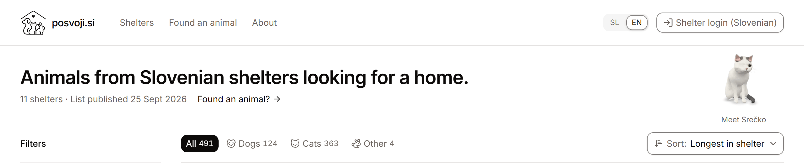

<p align="center">
  <picture>
    <source media="(prefers-color-scheme: dark)" srcset="docs/assets/logo-dark.svg">
    
  </picture>
</p>

<h1 align="center">Posvoji.si</h1>

<p align="center">
  One place to find animals waiting for a home in Slovenian shelters.<br>
  <a href="https://posvoji.si/en"><b>posvoji.si</b></a>
</p>

<p align="center">
  <a href="https://github.com/fresh55/posvoji/actions/workflows/ci.yml"></a>
  <a href="https://scorecard.dev/viewer/?uri=github.com/fresh55/posvoji"></a>
</p>

<p align="center">
  <b><a href="README.sl.md">Slovenščina</a></b> ·
  <a href="CONTRIBUTING.md">Contributing</a> ·
  <a href="docs/DATA-POLICY.md">Data policy</a> ·
  <a href="SECURITY.md">Security</a> ·
  <a href="https://github.com/fresh55/posvoji/issues/new/choose">Report a problem</a>
</p>

Slovenian shelters publish their animals on their own websites, each in its
own way. Posvoji.si puts them in one place, with the same basic facts for each
animal: name, species, sex, rough age, status and shelter.

Posvoji.si does not handle adoptions. Each animal links to the shelter's own
listing, or, for a shelter without a website, to the listing it published
here. The adoption always happens with the shelter.

> [!IMPORTANT]
> Not every shelter is included, and a listing can lag behind the shelter's
> own page. Confirm with the shelter that an animal is still available.

<picture>
  <source media="(prefers-color-scheme: dark)" srcset="docs/assets/preview-dark.png">
  
</picture>

## For shelters

Your content stays yours. Your animals appear only after you give written,
dated permission, and photos, descriptions and your logo only if that
permission covers them. You can ask at any time to change how you are shown,
remove photos or descriptions, or switch your listings off. Withdrawal
requests come first: [info@posvoji.si](mailto:info@posvoji.si).

The crawler identifies itself as `PosvojiBot`, respects `robots.txt` and sends
one request at a time. The project never collects private-owner listings,
personal data of owners, adopters or applicants, or microchip numbers. The
binding rules are in the [data policy](docs/DATA-POLICY.md).

## Run it locally

You need Node.js 24 and pnpm 10.

```bash
git clone https://github.com/fresh55/posvoji.git
cd posvoji
pnpm install --frozen-lockfile
pnpm --filter web dev
```

The site opens at <http://localhost:3000> with an empty animal grid: the
dataset comes from crawling shelter websites and is not committed. The checks
to run before a pull request are in [CONTRIBUTING.md](CONTRIBUTING.md).

## Contributing

Useful work includes fixing a parser when a shelter changes its website,
adding a shelter that is not covered yet, improving the Slovenian or English
text on the site, and reporting a wrong listing. A new shelter adapter can be
merged before the shelter's permission arrives, but stays disabled until then;
see [Adding a provider](docs/ADDING-A-PROVIDER.md).

[@fresh55](https://github.com/fresh55) maintains the project and merges pull
requests.

```text
shelter website ──▶ polite crawl ──▶ JSON dataset ──▶ static site
                                          ▲
shelter staff ──▶ private portal ─────────┘
```

## Reporting problems

Wrong or outdated listing: [open an issue](https://github.com/fresh55/posvoji/issues/new/choose),
and leave out other people's personal data. Vulnerabilities and anything that
could expose personal data: report privately as described in
[SECURITY.md](SECURITY.md). Adoption questions go to the animal's shelter.

## License

The code is open source: `apps/*` under AGPL-3.0-only, `packages/*` and
`providers/*` under MIT.

Shelter content is not. Photos, descriptions, logos and the animal data shown
on posvoji.si are used with each shelter's permission for this site only; any
other reuse needs the shelter's own permission. The Posvoji.si name and logo
are not covered by the code licenses. The shelter registry in
`data/shelters.yaml` is based on the public register kept by UVHVVR.
