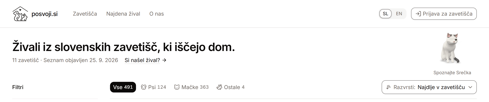

<p align="center">
  <picture>
    <source media="(prefers-color-scheme: dark)" srcset="docs/assets/logo-dark.svg">
    
  </picture>
</p>

<h1 align="center">Posvoji.si</h1>

<p align="center">
  Živali iz slovenskih zavetišč, ki iščejo dom, na enem mestu.<br>
  <a href="https://posvoji.si"><b>posvoji.si</b></a>
</p>

<p align="center">
  <a href="https://github.com/fresh55/posvoji/actions/workflows/ci.yml"></a>
  <a href="https://scorecard.dev/viewer/?uri=github.com/fresh55/posvoji"></a>
</p>

<p align="center">
  <b><a href="README.md">English</a></b> ·
  <a href="CONTRIBUTING.md">Za razvijalce</a> ·
  <a href="https://github.com/fresh55/posvoji/issues/new/choose">Predlagaj zavetišče</a> ·
  <a href="docs/DATA-POLICY.md">Podatkovna politika</a> ·
  <a href="SECURITY.md">Varnost</a>
</p>

Slovenska zavetišča objavljajo svoje živali vsako na svoji spletni strani in
vsako po svoje. Kdor išče psa, mačko ali zajca, mora vedeti, katera zavetišča
sploh obstajajo, in jih pregledati enega za drugim. Posvoji.si zbere te objave
na enem mestu, z enakimi osnovnimi podatki za vsako žival: ime, vrsta, spol,
približna starost, status in zavetišče.

Posvoji.si ne vodi posvojitev. Žival, ki jo najdemo na spletni strani
zavetišča, je povezana na tisto objavo. Zavetišče brez lastne spletne strani
lahko živali objavi neposredno pri nas, in takrat je izvirna objava ta na
Posvoji.si. Posvojitev v obeh primerih poteka pri zavetišču.

> [!IMPORTANT]
> Niso vključena vsa slovenska zavetišča, objava pa lahko zaostaja za stranjo
> zavetišča. Pri zavetišču vedno preverite, ali je žival še na voljo.

<picture>
  <source media="(prefers-color-scheme: dark)" srcset="docs/assets/preview-sl-dark.png">
  
</picture>

## Za zavetišča

Vaše vsebine ostanejo vaše. Živali zavetišča se prikažejo šele, ko zavetišče
izda pisno in datirano dovoljenje. Obseg dovoljenja je zapisan v
`providers/<zavetišče>/policy.yaml`, kjer ga preverja CI, sistem pa vira brez
dovoljenja ne more vklopiti. Fotografije, avtorski opisi in logotip zavetišča
se prikažejo samo, če jih dovoljenje zajema.

Zavetišče lahko kadarkoli zahteva:

- spremembo prikaza ali navedbe vira;
- umik fotografij ali opisov;
- redkejše osveževanje;
- popoln izklop vira.

Zahteve za umik imajo prednost. Pišite na
[info@posvoji.si](mailto:info@posvoji.si).

Pri samodejnem zajemu se `PosvojiBot` predstavi s kontaktom, spoštuje
`robots.txt`, pošilja največ eno zahtevo naenkrat na strežnik, med zahtevami
čaka in ob omejitvah odneha. Projekt nikoli ne zbira zasebnih oglasov, osebnih
podatkov lastnikov, posvojiteljev ali prosilcev, številk mikročipov in ničesar
s Facebooka ali drugih omrežij. Zavezujoča pravila so v
[podatkovni politiki](docs/DATA-POLICY.md).

## Zagon na svojem računalniku

Potrebujete **Node.js 24** (glej `.node-version`) in **pnpm 10**. Druge
podprte različice Node so navedene v `package.json`.

```bash
git clone https://github.com/fresh55/posvoji.git
cd posvoji
pnpm install --frozen-lockfile
pnpm --filter web dev
```

Stran se odpre na <http://localhost:3000>. Sveža kopija nima podatkov o
živalih, ker nastanejo z zajemom spletnih strani zavetišč in niso v
repozitoriju. Mreža živali je zato prazna, seznam zavetišč pa se prikaže.
Testi nikoli ne zajemajo strani; uporabljajo majhne lokalne vzorce.

Pred odprtjem zahteve za združitev (pull request) zaženite preverjanja, ki jih
izvaja CI. `pnpm test` zajema tudi portal za zavetišča, zato potrebuje
**Python 3.12+** in **uv**; nastavitev portala je v
[`apps/portal/README.md`](apps/portal/README.md).

```bash
pnpm typecheck
pnpm lint
pnpm test
pnpm validate:policies
```

Ob spremembah v `apps/web` zaženite še `pnpm --filter web build`.

## Prispevanje

Koristni prispevki so na primer:

- popravek razčlenjevalnika, ko zavetišče spremeni spletno stran;
- nov adapter za zavetišče, ki ga še ni;
- boljše slovensko ali angleško besedilo na strani;
- prijava napačne ali zastarele objave.

Adapter lahko napišete in združite, preden zavetišče izda dovoljenje, a do
takrat ostane izklopljen. Začnite s `providers/_template` in sledite navodilom
[Adding a provider](docs/ADDING-A-PROVIDER.md).

Projekt vzdržuje [@fresh55](https://github.com/fresh55), ki pregleduje in
združuje zahteve. Najprej preberite [CONTRIBUTING.md](CONTRIBUTING.md).
Naslovi zahtev sledijo [Conventional Commits](docs/COMMIT-CONVENTION.md), ker
se zahteve združujejo s squash.

## Kako deluje

```text
spletna stran zavetišča ──▶ vljuden zajem ──▶ podatki ──▶ statična spletna stran
                                  ▲
osebje zavetišča ──▶ zasebni portal ──▶ popravki in neposredne objave
```

Zajem prebere vsako vklopljeno zavetišče, rezultat preveri po shemi in zapiše
JSON. Spletna aplikacija iz njega zgradi statično stran, ki nikoli ne sprašuje
baze. Osebje zavetišča se prijavi v ločen portal z lastnim API in bazo, kjer
popravi podatke ali živali objavi neposredno.

## Ste našli napako?

Napačen podatek, zastarela objava ali žival, ki je že našla dom?
[Odprite prijavo](https://github.com/fresh55/posvoji/issues/new/choose).
Prijave so javne, zato ne vpisujte osebnih podatkov drugih ljudi.

Varnostne ranljivosti in vse, kar bi lahko razkrilo osebne podatke, prijavite
zasebno po navodilih v [SECURITY.md](SECURITY.md). Vprašanja o posvojitvi
naslovite na zavetišče, ki žival oskrbuje.

## Licence

Koda je odprtokodna. Aplikacije v `apps/*` so pod licenco **AGPL-3.0-only**;
sheme, SDK in adapterji v `packages/*` ter `providers/*` so pod licenco
**MIT**.

Vsebine zavetišč niso. Fotografije, opisi, logotipi in vzorci HTML ostanejo
gradivo zavetišč, tudi podatki o živalih na posvoji.si pa niso na voljo pod
odprto licenco. Zavetišča dovolijo uporabo samo za ta indeks, zato vsaka druga
uporaba potrebuje dovoljenje zavetišča, ki ga lahko kadarkoli spremeni ali
umakne.

`data/shelters.yaml` temelji na javnem registru zavetišč, ki ga vodi Uprava RS
za varno hrano, veterinarstvo in varstvo rastlin (UVHVVR), in na poznejših
preverjanjih spletnih strani zavetišč.

Licence kode ne pokrivajo imena in logotipa Posvoji.si. Odcepljeni projekt
(fork) lahko kodo uporabi, ne sme pa se predstavljati kot Posvoji.si.
