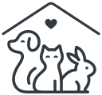

  <picture>
    <source media="(prefers-color-scheme: dark)" srcset="docs/assets/logo-dark.svg">
    
  </picture>

# Posvoji.si

🇬🇧 English (za razvijalce): [README.md](README.md)

Odprt in brezplačen seznam živali iz slovenskih zavetišč, ki iščejo dom.

## Kaj Posvoji.si je

Iskalnik, ki na enem mestu zbere osnovna dejstva o živali (ime, vrsto, spol,
približno starost, status in zavetišče) ter pri vsaki živali pokaže, od kod
podatek prihaja in kdaj je bil nazadnje osvežen. Klik na žival vodi na
originalno objavo zavetišča.

## Kaj Posvoji.si ni

Nismo zavetišče, nismo posrednik in ne vodimo postopkov posvojitve. Posvojitev
vedno poteka pri zavetišču, po njihovih pravilih. Prav tako nismo kopija vaših
strani: brez povezave nazaj na vir pri nas ni nobene živali.

Ne objavljamo zasebnih oglasov ("oddajo lastniki", "privat oddaja"), ker ti
vsebujejo telefonske številke fizičnih oseb. Ne zbiramo osebnih podatkov
lastnikov, posvojiteljev ali prosilcev in ne shranjujemo številk mikročipov.

## Za zavetišča

Kratko in jasno: **vaše vsebine ostanejo vaše.**

Brez vašega pisnega dovoljenja ne prikažemo vaših fotografij in ne prepišemo
vaših opisov. Dovoljenje, ki nam ga daste, je zapisano v naši kodi kot
datoteka, sistem pa preprosto ne dovoli vklopa vira, dokler ga ni.

Sodelujete lahko na tri načine, izberete pa tistega, ki vam najbolj ustreza:

1. pošljete nam strukturiran vir (API, RSS, XML, CSV), pri čemer vaše strani
   sploh ne beremo,
2. dovolite, da javne podatke samodejno preberemo z vaše strani,
3. živali vnašate ročno prek preprostega obrazca.

Če se odločite za drugo možnost: naš robot se predstavi z imenom in kontaktom,
spoštuje `robots.txt`, vašo stran obišče dvakrat na dan in med zahtevami čaka.
Če vaš strežnik reče, naj neha, neha.

Kadarkoli lahko zahtevate spremembo prikaza, izključitev fotografij, redkejše
osveževanje ali popolno odstranitev vašega zavetišča. Takšne zahteve rešujemo
prednostno in brez pogajanj.

Podrobnosti so v [docs/DATA-POLICY.md](docs/DATA-POLICY.md).

## Našli ste napako?

Napačen podatek, zastarela objava ali žival, ki je že našla dom?
[Odprite prijavo](../../issues/new/choose) ali nam pišite. Prosimo, ne
vpisujte osebnih podatkov drugih ljudi.

## Za razvijalce

Projekt je odprtokoden in vesel vsake pomoči, od popravkov razčlenjevalnikov do
oblikovanja. Tehnična dokumentacija je v angleščini:
[README.md](README.md) in [CONTRIBUTING.md](CONTRIBUTING.md).
