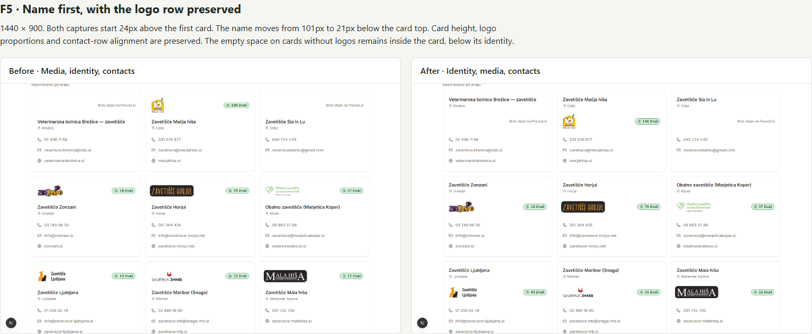
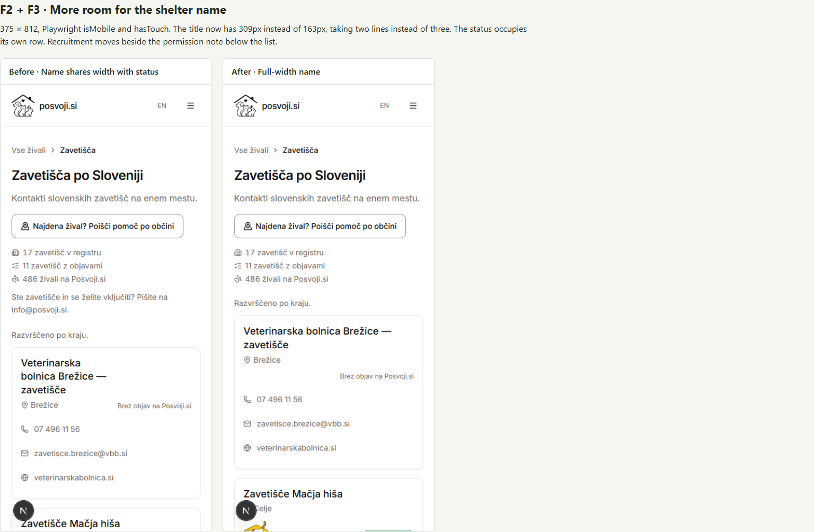

# Shelter audit verdict

Implemented on `codex/shelter-ux-followup`, starting from fetched `origin/main` at `553dd33` and updated to `7b7c229` before final verification. The original workspace and its staged changes were not used as the implementation base.

## Revised decisions

| Finding | Accepted scope | Result |
| --- | --- | --- |
| F1 | Declined: retain the town-sorted directory without lookup controls. | No search, town strip or group headings added. |
| F2 | Move only the recruitment sentence. | Recruitment follows the directory beside the permission note; census and introduction otherwise retained. |
| F3 | Remove the phone fold on cards without a logo. | Names receive the full width; the status has a separate row. |
| F4 | Declined: retain the existing stretched card link. | No per-card button added; contact links, hover and focus behavior retained. |
| F5 | Approved: content first and media second from `sm` upwards. | Shelter-local track overrides preserve subgrid alignment and logo proportions. Desktop and tablet comparisons were reviewed and approved; the name now leads at every width. |
| F6 | Strengthen the existing route to animal filters. | Outline small button, filter icon and action wording in both languages; shelter query preserved. The final sizing follows `CONTACT_BUTTON`, including `min-h-11` for a minimum 44px touch target. |
| F7 | Declined: do not link a known dead source. | Citation unchanged. The dead-link history was supplied by the user; this implementation did not recheck the remote PDF. |

## Measurement corrections and results

The original audit used a narrow desktop browser with a classic scrollbar. Its nominal 390px viewport had 375px of content width. The follow-up uses Playwright with `isMobile: true` and `hasTouch: true`, and asserts the actual content width and coarse-pointer mode. Census breakpoints were not changed.

| Measurement | Before | After |
| --- | --- | --- |
| Census at true 390px mobile width | 2 lines | 2 lines |
| First shelter title width at 375px | 163px | 309px |
| First shelter title at 375px | 3 lines | 2 lines |
| First card top at 390px | 452.5px | 395px |
| Desktop title offset inside card | 101px | 21px |

Desktop card heights and contact-row alignment are unchanged. The blank area on logo-less cards moves below the identity rather than being removed. Giving statuses their own phone row adds some document height: at 390px, the full page grows from 6,001px to 6,053px, even though the first card appears approximately 58px earlier. This is the accepted tradeoff for names retaining their width.

The review independently confirmed that the first six desktop cards are 292px tall, with names starting 21px into each card, the media band at 79px and contacts at 159px. At 375px with a coarse pointer, Brežice's name retains 309px, wraps to two lines and is followed by a separate 16px status row; the first card starts at 419px.

The environment direction is also clarified: the previously audited preview was the newer checkout relative to the original task workspace. This implementation follows current `origin/main`, not the stale staged tree.

## Before/after evidence

These comparison images are stored alongside this verdict so they remain available in the repository:

The sheet uses the same dataset and cached logo files on both sides. Some detail-page development captures show an existing reduced-motion hydration warning in the photo gallery, also present before these edits. This unrelated gallery behavior was not changed.

## Final verification

The required checks were rerun after the touch-target, comment-restoration and document-portability fixes. The comparison images show the reviewed layout before those final fixes; the filter action now measures 44px tall on a phone.

- `pnpm typecheck` — passed.
- `pnpm lint` — passed, including portal and operation checks.
- `pnpm test` — 4,204 passed, including 2,757 web tests and 371 portal tests; 4 portal tests skipped.
- `pnpm validate:policies` — passed, 16 valid and 0 invalid policies.
- `pnpm --filter web build` — passed with the copied local dataset.
- Browser suite — 37 passed: the complete shelter-register suite in Chromium and the mobile name-width and filter-action regressions in WebKit. Names were checked in both languages at 320, 375 and 390px; the filter action was checked at 375px for a minimum 44px target and successful navigation with the shelter retained.
- Filter action — tapped in both mobile language variants; each reached the animal search with `zavetisce=macja-hisa` retained and no page errors.
- Independent code/visual review — the F5 tradeoff was reviewed against desktop and tablet captures. The subsequent user review approved F5 and requested the three final fixes recorded below.

The obsolete unit assertion for the folded CSS was removed in favor of browser geometry checks. Existing invitation order and skip-link assertions now follow the new position of the recruitment sentence.

Two share images regenerated by the production build were restored to their baseline contents; they are outside this change.

## Final review fixes

- Use the contact-button sizing idiom for the filter action, preserving a minimum 44px touch target.
- Restore the card's design rationale for town-sorted full cards, separate logo rows, counts in the media band and the absence of initial-letter discs. Remove the obsolete phone-fold explanation and document why the name leads at every width.
- Keep this verdict and both comparison images together in the dated audit directory, with portable relative image links.

The review also noted two optional cleanups, deferred from this change: avoid the new browser test's fixed seventeen-card expectation, and fold the unconditional `CARD_PHONE_STACK` classes into `CARD`.
