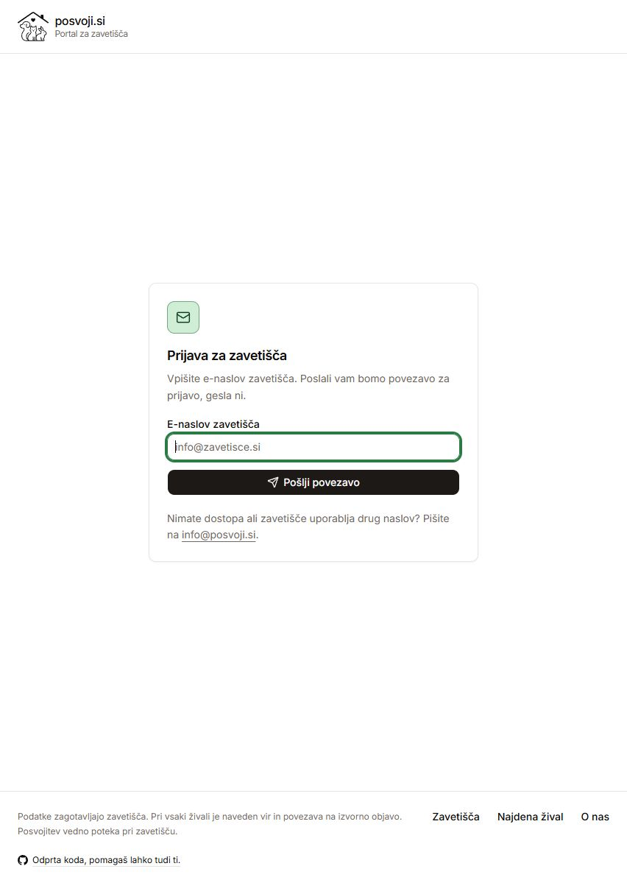
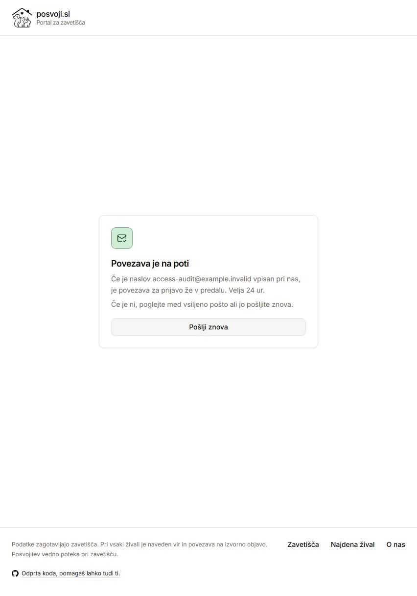
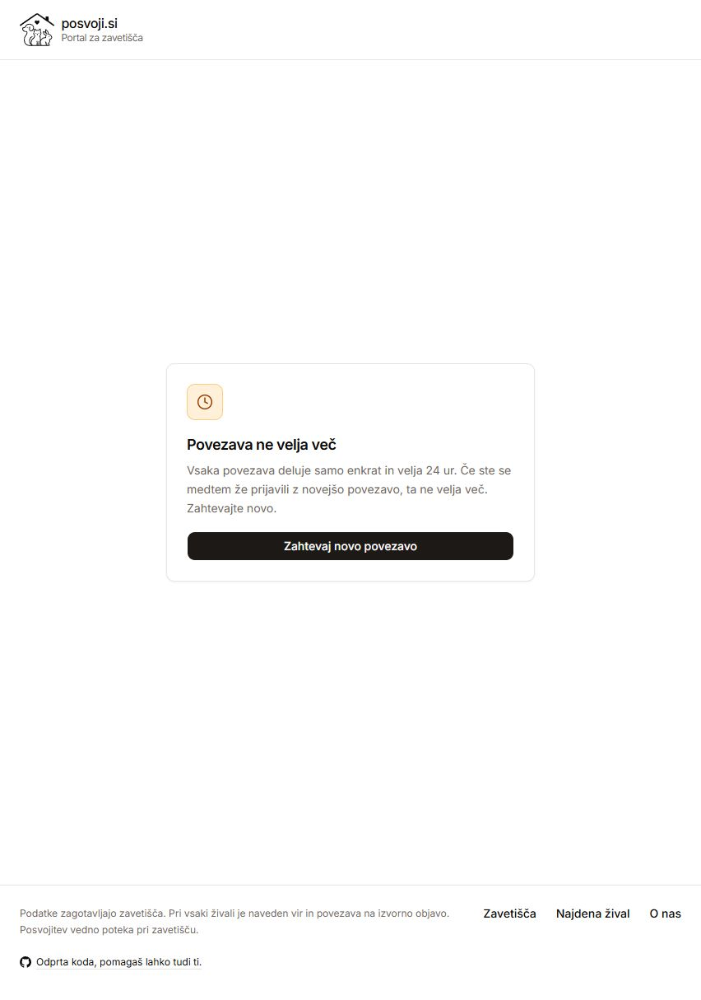
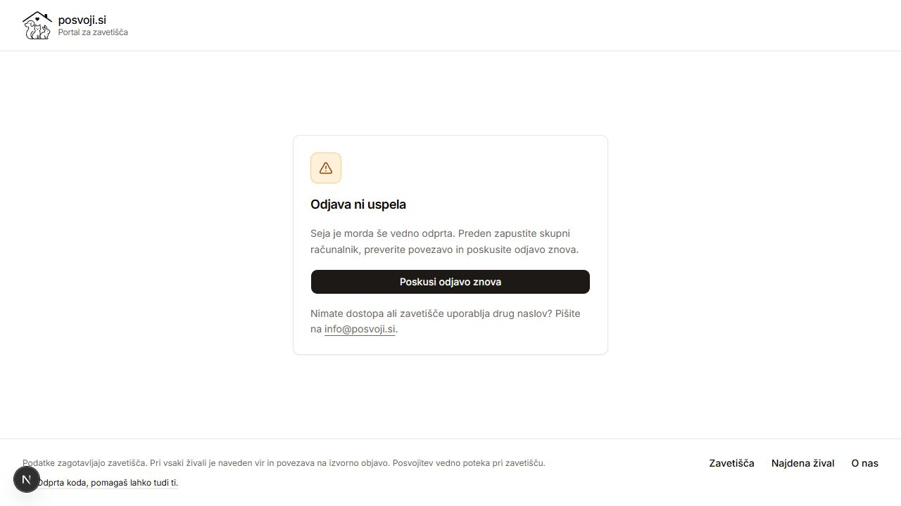
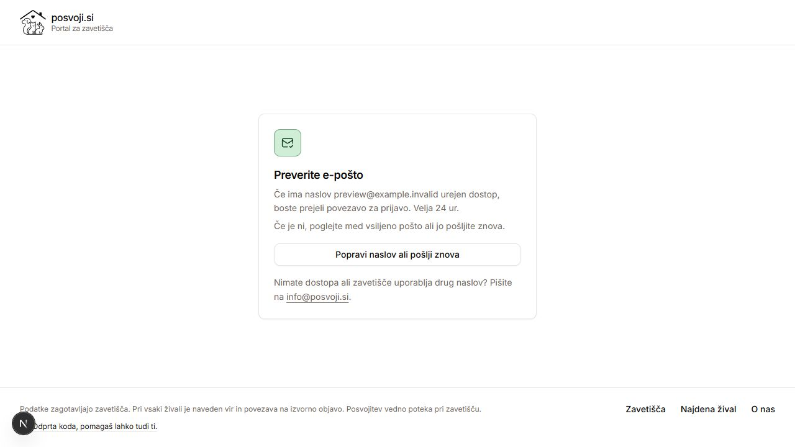
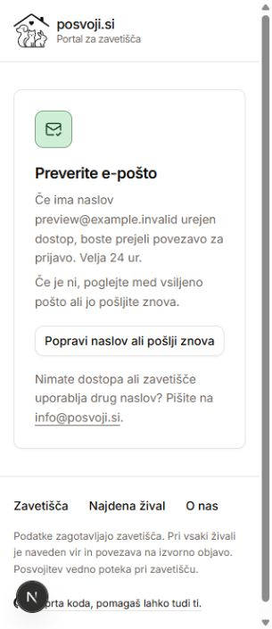

# Shelter access readiness: 17 September 2026

This is the canonical record. It supersedes the overlapping
[login audit](2026-09-17-shelter-login-audit.md) and combines its production
observations with the later source review and fixes. Historical observations
are distinguished from current local verification below.

**Prelaunch hold:** do not email shelters, send invitations, or run a production
mailbox test until the owner explicitly authorizes outreach after launch. No
messages were sent during either audit or this implementation. A real mailbox
test remains necessary, but is deliberately deferred.

## Launch priorities and root cause

The registry email was being used both as a public contact and as an automatic
access grant. Seeding memberships without checking provider readiness gave four
shelters a workspace that could not publish. This is the main launch blocker;
the concurrent-token race is a smaller, inexpensive hardening fix.

| Priority | Original finding | Decision and implemented behavior |
|---|---|---|
| P1 | 5 and 6: premature access | Grant registry access only with an institutional email, an enabled provider, recorded permission and a recognized ingestion mode. Remove existing registry grants when these conditions stop holding. Keep public shelter records. No pending-state UI is needed. |
| P1 | 3: removed registry entry | Default seeding reports absent shelters that retain registry access. Only explicit `--prune` removes their registry memberships. Admin and development memberships, users and historical edits survive. Invalid or duplicate registry rows abort the transaction. |
| P2 | 1: overlapping token use | Wrap verification and login in one transaction. SQLite's configured IMMEDIATE mode prevents two requests from validating the same old `last_login`. A copied valid link is required for the original race; sequential replay was already blocked. |
| P2 | 2: failed logout | Preserve the deliberate redirect away from the workspace. On failure, show “Odjava ni uspela” on the login page with a retry action. Retain the notice on reload until logout succeeds or the API confirms there is no session. |
| P2 | 8: confirmation recovery | Keep the support link on confirmation, invalid-link and logout-failure cards. Use conditional delivery wording and label the action as correcting the address or requesting a new link. |
| P3 | 7: duplicate email hygiene | Admin creation and editing reject case-insensitive duplicate nonempty emails. An existing user can retain its own email. This is form validation, not a database uniqueness migration or a cleanup of existing duplicates. |
| Onboarding | 4: Mala hiša | Still needs a verified institutional address. Do not guess one. |

All changes above are prepared in the access-readiness branch, not deployed.
The email-change revocation fix is isolated in
[PR #248](https://github.com/fresh55/posvoji/pull/248), commit `c6f1e98`, with its
tests and operator documentation. It is separate from unrelated working-tree
changes. The readiness branch builds on it.

## Production observations from the earlier login audit

These were recorded earlier on 17 September, before the fixes. They were not
rechecked during implementation and do not prove the current server revision.

- The `posvoji-portal` service had three active workers, checkout `e5b3c13`, no
  portal changes and migrations through `0007_sheltermembership_source`.
  The API service and static frontend are deployed separately.
- The live login page and API were reachable outside the preview gate. A
  reserved-domain unknown address exercised the browser request and CSRF path
  and received the generic confirmation; no shelter message was sent.
- SMTP accepted STARTTLS with certificate validation and authentication (235).
  Sender and authentication addresses matched. No message was submitted, so
  mailbox delivery remains unproven.
- Sixteen of 17 shelters had active, registry-sourced memberships. Mala hiša
  had none. Registry addresses matched the memberships; no duplicate email
  groups or additional administrator-managed memberships were found.
- No non-staff user had a recorded `last_login`. The preceding seven days of
  retained service logs showed no successful link requests, token verifications
  or mail-failure markers. This supports “no observed shelter login”, not an
  unlimited historical claim that nobody has ever used the portal.

The subsequent anonymous browser audit confirmed the form, confirmation,
invalid-link rejection and workspace redirect. It did not access real shelter
mailboxes or authenticated production workspaces.

## Shelter readiness after the new seeding rule

This is the expected result from the repository configuration after deploying
and running the updated seed, not a claim that production accounts were changed.

| Shelter | Registry provisioned access | Workspace or blocker |
|---|---|---|
| Zonzani | Eligible | Corrections |
| Obalno / Marjetica Koper | Eligible | Corrections |
| Ljubljana | Eligible | Corrections |
| Oskar Vitovlje | Eligible | Manual listings |
| Horjul | Eligible | Corrections |
| Turk | Eligible | Corrections over API data |
| Meli Center Repče | Eligible | Corrections |
| Mala hiša | Not eligible | Missing institutional email |
| Maribor / Snaga | Eligible | Corrections |
| Mačji dol / Žverca | Eligible | Corrections |
| Veterina Sevnica | Not eligible | Disabled manual provider; permission not recorded |
| Veterinarska bolnica Brežice | Not eligible | No provider |
| Mačja hiša | Eligible | Corrections |
| Johanca | Eligible | Manual listings |
| Muri | Eligible | Corrections |
| Potepuhi | Not eligible | Disabled manual provider; permission not recorded |
| Sia in Lu | Not eligible | No provider |

The expected registry membership count becomes 12. Existing explicit admin
grants are preserved by design; an operator must review any such exceptions.
Eligibility is reconciled when `seed_shelters` runs, not dynamically on every
request. Policy changes therefore require reseeding before inviting users.

## Deployment procedure, with outreach held

1. Review and land the separate email-change fix and readiness changes. Deploy
   the portal and frontend from the intended revisions; a static-site deploy
   alone does not update the Django service.
2. Back up the portal database using the existing operational procedure. Inspect
   the full registry and provider policies. Run the updated `seed_shelters`.
   It will withdraw the four ineligible registry grants even without `--prune`.
3. Review the command's absent-ID report. Use `seed_shelters --prune` only when
   those omissions are intentional. An explicitly empty registry with that flag
   removes all registry grants; the flag must never be appended automatically.
4. Confirm the expected 12 registry grants and any separately approved admin
   exceptions. Confirm that Mala hiša remains an address-onboarding task.
5. **Stop before outreach.** Once the owner later authorizes it, use one friendly
   shelter's verified institutional mailbox to request a link, confirm receipt,
   open the correct workspace, verify session persistence, sign out, and verify
   that `/api/me` is anonymous. Keep test changes away from public animal data.

The two previously discussed candidates were Johanca and Oskar. Neither is an
approved send destination during the prelaunch hold. SMTP success and a generic
204 response do not substitute for the eventual end-to-end test.

## Regression coverage and evidence lifecycle

The original `reproduce.py` deliberately asserted buggy outcomes. Passing those
probes meant “reproduced”, not “fixed”. They must not become a permanent second
test suite. Each fixed finding moves into the normal suite as a desired-behavior
regression, and its old probe is deleted. All four probes have now been retired:

- `apps/portal/tests/test_seed.py`: ineligible providers never gain registry
  access; existing grants are revoked; manual grants survive; absent entries
  require explicit pruning; invalid input cannot partially revoke access.
- `apps/portal/tests/test_login_concurrency.py`: exactly one of two overlapping
  token exchanges authenticates. The former barrier is bounded because the
  correct transaction intentionally holds the other worker outside validation.
- `apps/portal/tests/test_admin_accounts.py`: duplicate emails are rejected on
  admin creation and editing, and a distinct passwordless inbox can be created.
- `apps/web/hooks/use-portal-session.test.tsx` and
  `apps/web/components/portal/portal-login.test.tsx`: redirect after failed
  logout, persistent failure notice, retry behavior, and access-help recovery.
- The isolated email-change PR retains the old-token revocation, replacement
  link, multiple-address and membership-removal tests.

Python bytecode is ignored repository-wide. The audit's `__pycache__` and
`reproduce.py` are removed. No generated Python cache is part of either PR.

## Historical browser captures

These are the original pre-fix screenshots, not screenshots of the corrected
UI. Saved images were reopened and inspected during that audit.

1. Login form: healthy loading, visible field focus and access-help contact.
2. Confirmation: generic response worked, but the support link disappeared.
3. Invalid link: token removed from the address bar and invalid-link recovery
   displayed; support contact was missing.
4. Anonymous `/portal`: correctly redirected to the same login form as step 1.
5. Real mailbox, authenticated workspace and logout: not exercised in production.

The browser audit checked accessible field names and focus movement but was
not an accessibility certification. Mobile layouts, measured contrast and a
screen-reader session were not covered.

## Validation status

The separate email-change PR passed its 39 authentication tests and GitHub CI.
The readiness changes passed 68 targeted portal tests, four admin tests and 68
targeted frontend tests before the complete check. `pnpm check` then passed:
typecheck, lint, the complete test suite, policy validation and the static web
build. The final suite contains 364 passing portal tests (four skipped) and
2,556 passing web tests. Lint retains the existing unused `CARDS_PER_CLICK`
warning. The isolated build used a local dataset snapshot without the public
animal-photo and shelter-logo cache, so it warned about missing media; no
production media generation or deployment was attempted.

The corrected screens were checked against a separate localhost API with an
empty database and an in-memory mail backend. No production API or mailbox was
used. Local step 1 showed the persistent logout-failure notice, step 2 retried
against an already-anonymous session and returned to the form, and step 3
submitted a reserved-domain address and retained the access-help link on the
confirmation. These screenshots were saved and inspected:

A narrow-phone check at 320 pixels caught an overflowing recovery action.
The shortened wording now fits; the final action was checked again on desktop.

The original audit's complete suite passed on repeat after two timing-sensitive
frontend tests failed once. Other reviewed risks remain outside these fixes:
file-cache throttle concurrency, synchronous mail delivery and the lack of an
explicit frontend request timeout.
